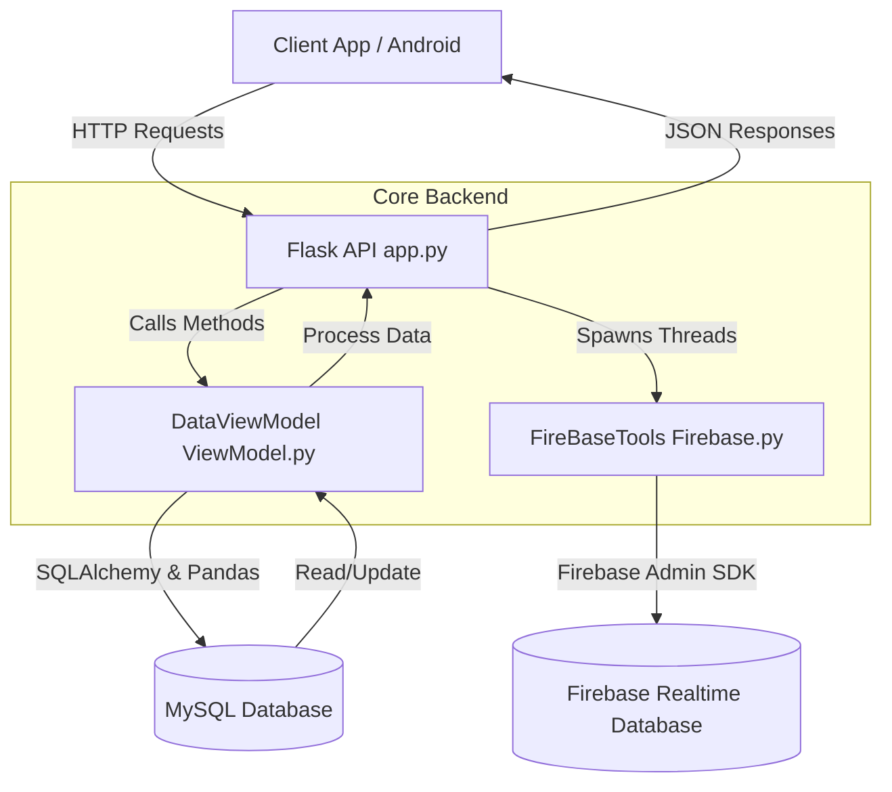

# ClaimEasy: Technical Deep Dive

## 1. Overall Architecture & Data Flow

At its core, ClaimEasy is a **RESTful backend service** built with Flask, acting as the bridge between client applications (like an Android app), a relational MySQL database, and Firebase Realtime Database. It follows an MVC-like pattern where `app.py` is the Controller, `ViewModel.py` manages data access and business logic (the Model layer abstraction), and `Firebase.py` acts as an external sync service.

### Component Breakdown
- **`app.py` (Controller):** Defines API routes, handles HTTP requests/responses, performs basic RBAC (Role-Based Access Control) checks, and orchestrates the ViewModel and Firebase tools.
- **`ViewModel.py` (Core Logic/Data Access):** Abstracts all database operations. It manages table schemas, ID generation, cross-table associations (like assigning claims to customers), and data normalization before/after DB insertion.
- **`Firebase.py` (External Integrations):** Handles aggregating data into "insights" (statistics) and pushing them to Firebase Realtime Database for live dashboards, often running in background threads to avoid blocking the main API response.

## 2. Library Deep Dive

Here is why specific libraries were chosen for this backend architecture:

- **Flask:** 
  - *Why:* A lightweight, synchronous WSGI web framework. It’s chosen for its simplicity and fast setup for routing HTTP requests. It doesn't enforce strict project layouts, which fits the single-file controller approach in `app.py`.
- **Pandas:**
  - *Why:* Usually reserved for data science, Pandas is used here innovatively as an ORM alternative and data manipulation engine. It's used to read SQL tables directly into DataFrames (`pd.read_sql`), making it incredibly fast to perform aggregations, ID generation (using `.max()`), and data formatting (handling dates, splitting strings).
- **SQLAlchemy:**
  - *Why:* The standard Python SQL toolkit. In this project, it's used primarily for connection pooling (`create_engine`) and safely executing parameterized raw SQL queries (`text()`) to prevent SQL injection, rather than using its full ORM capabilities.
- **Firebase Admin SDK (`firebase_admin`):**
  - *Why:* Connects a trusted backend to Firebase services. It’s used to update live statistics in the Realtime Database (RTDB), allowing client applications (like Admin dashboards) to subscribe to real-time metric updates without constantly polling the MySQL database.
- **Threading (Standard Library):**
  - *Why:* Used to decouple slow, network-dependent operations (like pushing to Firebase) from the main API request loop.

## 3. Core Logic Breakdown

### Initialization
When the server starts, `DataViewModel` initializes a connection pool to MySQL via SQLAlchemy. `FireBaseTools` initializes the Firebase Admin app using a service account key (`Firebase_admin_KEY.json`). The connection engine is kept alive and shared across incoming requests.

### The "Request Loop" (API Endpoints)
Since this is a web server, the "Main Loop" is the event loop listening for HTTP requests. 
1. **Receive & Validate:** `app.py` receives a JSON payload.
2. **Business Logic & Persistence:** It calls `vm.insert()`, `vm.update()`, etc. The ViewModel handles the SQL execution.
3. **Background Sync:** If the action changes overall statistics (e.g., creating a new claim), `app.py` spawns a background thread (e.g., `threading.Thread(target=ft.push_claims_insights).start()`) to update Firebase.
4. **Response:** The server returns a JSON acknowledgment to the client immediately, without waiting for Firebase.

### Data Processing & Transformation (The ViewModel)
The `ViewModel.py` shines in how it sanitizes data:
- **`_process_special_fields`:** Before inserting data, it catches complex structures. If a payload contains a list of claims, it converts it to a comma-separated string for MySQL. If it encounters complex date strings (like "Tue, 08 Apr 2025..."), it parses and normalizes them into standard "YYYY-MM-DD" SQL formats.
- **`_postprocess_df`:** When reading back from SQL, it reverses this process, taking comma-separated strings and blowing them back up into native Python lists for the JSON response.

### Parallelism & Performance
**The Producer-Consumer Analogy:** 
Think of the Flask API as a fast-food cashier (Producer) and the Firebase sync as the kitchen (Consumer). When a customer makes an order (API request), the cashier takes the money and updates the register (MySQL DB). Instead of the cashier walking back to the kitchen to cook the food (updating Firebase), they toss a ticket to the kitchen (spawning a `threading.Thread`) and immediately serve the next customer. 
This prevents "Race Conditions" on the main thread and ensures the user doesn't experience network latency from Firebase. Firebase transactions are handled using atomic updates (`ref.transaction()`) to prevent concurrent updates from overwriting each other.

## 4. External Integrations

### Firebase Realtime Database (RTDB)
- **Protocol:** Server-to-Server via Firebase Admin SDK (gRPC/HTTPS).
- **Data Formatting:** The `InsightGeneratorLogic` class reads the MySQL database using Pandas, aggregates the data (e.g., counting claims by status, grouping users by age using `.apply()`), and constructs a nested JSON dictionary.
- **Reliability:** The code uses Firebase's `transaction()` method (`update_counter` in `Firebase.py`). If two API requests try to increment the "Total Claims" counter simultaneously, the transaction ensures they are queued and applied sequentially, preventing data loss.

## 5. Technical "Whys": Key Design Decisions

1. **Why use Pandas alongside SQL?**
   - *Reasoning:* While SQL can do aggregations (COUNT, GROUP BY), writing complex dynamic aggregations can be verbose and hard to maintain. Pandas allows the developer to fetch a table and use Pythonic data manipulation (like grouping ages into buckets: "18-30", "30-40") entirely in memory, which is highly readable and flexible.
2. **Why use atomic counters for Firebase instead of full table pushes?**
   - *Reasoning:* In `handle_claim_create`, the code increments specific counters (`+1`) in Firebase instead of recalculating the entire database every time a single claim is made. This saves massive amounts of bandwidth and computation, scaling much better under heavy load.
3. **Why do Admins have `customer_id = None`?**
   - *Reasoning:* A Client represents a physical customer with insurance details. An Admin or ETL user is internal staff. Setting their `customer_id` to `None` creates a clean boundary in the database, allowing the system to use a single `user_accounts` table for authentication while separating staff from actual customers.
4. **Why the fallback mechanism in date parsing?**
   - *Reasoning:* In `update()`, the code wraps `datetime.strptime` in a `try/except` block. If the incoming date is already in the correct "YYYY-MM-DD" format, the `strptime` will fail, hit the `except` block, and pass smoothly (`pass`). This is a defensive programming tactic against inconsistent client payloads.
5. **Why generate IDs dynamically using Pandas (`generate_claim_id`)?**
   - *Reasoning:* Instead of relying on MySQL `AUTO_INCREMENT`, the system pulls the index, strips the string prefix (e.g., stripping "C" from "C2001"), finds the max integer, and increments it. This guarantees custom-formatted alphanumeric IDs (like "C2002", "PAY001") without needing complex SQL triggers.

## 6. Focus: The ViewModel & Problem Solving

The `DataViewModel` acts as the system's "Brain" for data integrity. Here's how it solves specific problems:

- **Problem:** Updating a customer's linked claims without duplicating or losing data.
- **ViewModel Solution (`app.py` leveraging `vm`):** When updating a customer, it fetches the *current* claims from the DB. It uses Python `set()` operations (`to_add = new_claims - current_claims` and `to_remove = current_claims - new_claims`) to find the exact delta. It then calls `vm.assign_claim()` only on new claims and `vm.deassign_claim()` only on removed claims. This is highly efficient and idempotent.
- **Problem:** Secure Deletion (Cascading).
- **ViewModel Solution (`delete` method):** When deleting a user, the ViewModel first safely queries to see if that user has an associated `customer_id`. It then deletes the user account, and *subsequently* deletes the associated customer record. This manual cascade ensures no orphaned customer data is left floating in the database.
